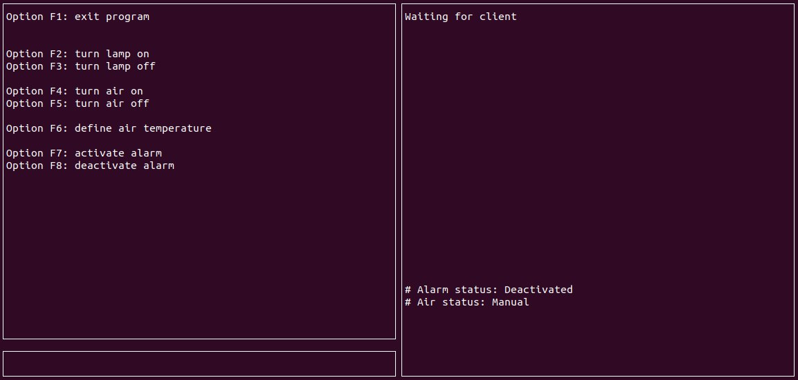
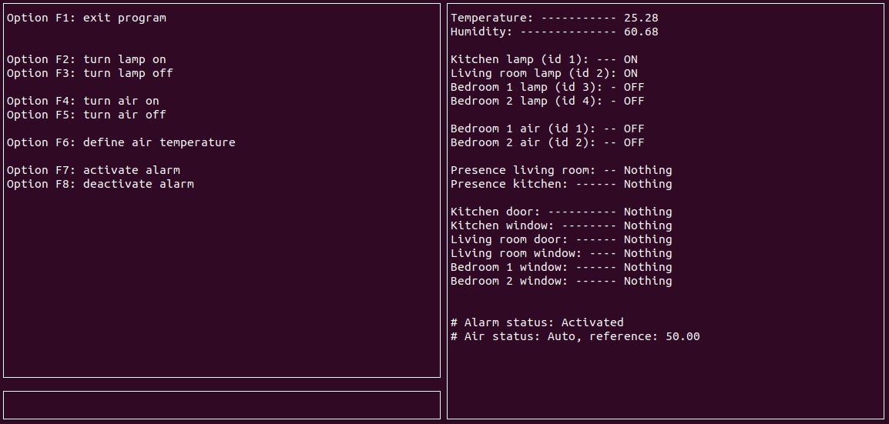

2º Projeto - Fundamentos de Sistemas Embarcados 2020.2 - UnB - Gama
=========================
Andre Lucas de Sousa Pinto - 17/0068251

#

Notas:

* Instrucoes para rodar o servidor central e o servidor distribuido no README dentro de suas respectivas pastas;

* Preferencialmente rode o servidor central primeiro.

* O programa gera 2 logs, um arquivo guardando os comandos do usuario e o outro guardando o acionamento de alarmes. Ao serem gerados ficarao na pasta CentralServer

#

## Images

Start Screen (Central Server)

Running Screen (Central Server)

